# Especificación Técnica de Ingeniería: Sovereign Assessment Factory v2026

Este documento detalla la arquitectura interna del motor de orquestación, exponiendo la complejidad real de la gestión de evidencias, el consenso adversario y la resolución topológica de la estrategia.

## Diagrama de Arquitectura de Misión Crítica (Full Detail)

```mermaid
flowchart TD
    %% --- INPUTS ---
    subgraph PHASE_0 ["Fase 0: Ingestión Multidimensional"]
        direction LR
        IN_DOCX([".docx Contexto Real"])
        IN_TXT([".txt Respuestas Test"])
        IN_ONT(["JSON Tower Ontologies"])
        IN_PROF(["Industry Profiles (Energy/PIC)"])
    end

    %% --- PHASE 1 ---
    subgraph PHASE_1 ["Fase 1: Infraestructura de la Verdad (Evidence Core)"]
        direction TB
        P1_1["1.1 EvidenceEngine (Python Determinista)"]
        P1_1_A["Block Iterator (Paragraph/Tables)"]
        P1_1_B["Heading Stack Persistence (H1-H3)"]
        P1_1_C["UUID/SHA-256 Anchor Generation"]

        VAULT[("evidence_vault.json<br/>(L0 Atomic Fragments)")]

        P1_2["1.2 RaptorEngine (Recursive AI Cluster)"]
        P1_2_A["Semantic Proximity Grouping"]
        P1_2_B["Hierarchical Summarization (L1-L2)"]

        TREE[("raptor_tree.json<br/>(Knowledge Tree)")]

        P1_3["1.3 IntegritySentinel (Gatekeeper)"]
        P1_3_A["Coverage Analysis (>99% required)"]
        P1_3_B["Ghost Node Classification"]

        Z_BASE{{"SALIDA Z: Base de Verdad Certificada"}}

        IN_DOCX --> P1_1
        P1_1 --> P1_1_A & P1_1_B & P1_1_C
        P1_1_C --> VAULT
        VAULT --> P1_2
        P1_2 --> P1_2_A --> P1_2_B --> TREE
        TREE --> P1_3 --> P1_3_A & P1_3_B
        P1_3_B --> Z_BASE
    end

    %% --- PHASE 2 ---
    subgraph PHASE_2 ["Fase 2: Intelligence Harvesting (Adversarial Truth)"]
        direction TB
        P2_1["2.1 GroundingSentinel (AI Sentinel)"]
        BOZAL[("grounding_contract.json<br/>(The Invariants)")]

        P2_2["2.2 SpecializedHarvesters (Staff AI Team)"]
        subgraph P2_2_G ["Agentes en Paralelo"]
            H_BIZ["Business (CEO Agenda)"]
            H_TECH["Tech (Footprint/EoL)"]
            H_REG["Regulatory (NIS2/PIC)"]
        end

        P2_3["2.3 AdversarialConsensus (Tribunal)"]
        P2_3_A["Conflict Detector (NLI Model)"]
        P2_3_B["Diplomatic Refiner (Tier 1 Tone)"]
        P2_3_C["The Judge (Final Verifier)"]

        P2_LOOP{{"Conflict detected?"}}

        V_ADN{{"SALIDA V: client_intelligence.json<br/>(DNA Dossier Signed)"}}

        Z_BASE --> P2_1 --> BOZAL
        BOZAL & Z_BASE --> P2_2_G
        H_BIZ & H_TECH & H_REG --> P2_3
        P2_3 --> P2_3_A --> P2_LOOP
        P2_LOOP -- "Yes" --> P2_2_G
        P2_LOOP -- "No" --> P2_3_B --> P2_3_C --> V_ADN
    end

    %% --- PHASE 3 ---
    subgraph PHASE_3 ["Fase 3: Technical Deep-Dive (Tower Analysis)"]
        direction TB
        P3_1["3.1 build_case_input (Python)"]
        P3_1_A["Context Pruning (Tower-specific)"]
        P3_1_B["Pre-Scoring (Mathematical Mean)"]

        P3_2["3.2 build_evidence_ledger (Semantic Aligner)"]
        P3_2_A["RAPTOR L1 to Pillar Matching"]
        P3_2_B["L0 Fragment to KPI Anchoring"]

        P3_3["3.3 run_evidence_analyst (IA Senior Specialist)"]
        P3_3_A["Forest View (Strategic Context)"]
        P3_3_B["Tunnel View (Granular Finding)"]

        P3_4["3.4 run_sota_researcher (OSINT Agent)"]
        P3_5["3.5 run_executive_refiner (Tower Refiner)"]

        FINDINGS[("findings.json<br/>(Evidence-Anchored Findings)")]

        V_ADN & IN_TXT & IN_ONT --> P3_1 --> P3_1_A & P3_1_B
        P3_1_B & Z_BASE --> P3_2 --> P3_2_A & P3_2_B
        P3_2_B --> P3_3 --> P3_3_A & P3_3_B --> P3_4 --> P3_5 --> FINDINGS
    end

    %% --- PHASE 4 ---
    subgraph PHASE_4 ["Fase 4: Blueprint Factory (Product Generation)"]
        direction TB
        P4_1["4.1 PilarArchitect (Writer)"]
        P4_2["4.2 BlueprintCritic (Refiner)"]
        P4_3["4.3 MasterOrchestrator (Coherence)"]
        P4_LOOP{{"Quality Check Passed?"}}
        P4_4["4.4 Pydantic Validator (Contract-First)"]

        BLUEPRINT[("blueprint_payload.json<br/>(The Source of Truth)")]

        FINDINGS & V_ADN --> P4_1 --> P4_2 --> P4_LOOP
        P4_LOOP -- "No" --> P4_1
        P4_LOOP -- "Yes" --> P4_3 --> P4_4 --> BLUEPRINT
    end

    %% --- PHASE 5 ---
    subgraph PHASE_5 ["Fase 5: Strategic Resolution (Epistemic Graph)"]
        direction TB
        P5_1["5.1 GraphSync (Subject-Predicate-Object)"]
        P5_2["5.2 NetworkXAnalyzer (DAG)"]
        P5_2_A["Topological Sort (Wait-For)"]
        P5_2_B["Wave Assignment (H1-H3)"]

        DTO[("digital_twin_state.json<br/>(The Solved Strategy)")]

        BLUEPRINT --> P5_1 --> P5_2 --> P5_2_A & P5_2_B --> DTO
    end

    %% --- PHASE 6 ---
    subgraph PHASE_6 ["Fase 6: Delivery (Sovereign Portal)"]
        P6_1["6.1 RenderWebPresentation (Bundler)"]
        P6_1_A["Modular CSS/JS Inlining"]
        P6_1_B["Data Hydration Injection"]

        PORTAL["Sovereign Portal V13 (Editorial Folio)"]

        DTO & BLUEPRINT & V_ADN --> P6_1 --> P6_1_A & P6_1_B --> PORTAL
    end

    %% Estilos de Estado y Datos
    style Z_BASE fill:#2ecc71,stroke:#fff,stroke-width:2px,color:#fff
    style V_ADN fill:#3498db,stroke:#fff,stroke-width:2px,color:#fff
    style BLUEPRINT fill:#e67e22,stroke:#fff,stroke-width:2px,color:#fff
    style DTO fill:#9b59b6,stroke:#fff,stroke-width:2px,color:#fff
    style VAULT fill:#161b22,stroke:#86efac,color:#86efac
    style TREE fill:#161b22,stroke:#86efac,color:#86efac
```

## Desglose de "Mecanismos Internos"

### 1. El Bucle de Sanación (Phase 2 & 4 Loops)
*   **Adversarial Loop (P2):** Si el agente Juez detecta una contradicción entre el Footprint Técnico y la Agenda de Negocio, el sistema retroalimenta a los analistas originales con la objeción, forzándolos a re-analizar el fragmento del Word original.
*   **Blueprint Critic (P4):** El Arquitecto propone un proyecto; el Crítico lo rechaza si no cumple el **DOD (Definition of Done)** o si el sizing (S, M, L, XL) no es coherente con el score de madurez.

### 2. Epistemic Graph Sync (P5)
No es un simple mapeo de datos. El motor transforma cada hallazgo en una **Tripleta Semántica**:
*   `[ID_PROYECTO] -- REQUIRES --> [ID_DEPENDENCIA]`
*   `[ID_RIESGO] -- IMPACTS --> [ID_PILLAR]`
Esto permite al `NetworkXAnalyzer` aplicar algoritmos de teoría de grafos para calcular el **Camino Crítico** de la transformación de Redeia, asegurando que el Roadmap no sea una lista, sino una secuencia lógica.

### 3. El Alineador Semántico (P3.2)
Cruza el **Árbol RAPTOR** (visión global del Word) con el **Pre-Scoring** (visión técnica del Test).
*   Si el Test tiene una nota baja en un área que el RAPTOR ha marcado como "Prioridad Estratégica", el sistema eleva automáticamente la **Gravedad del Riesgo** y la **Prioridad de la Iniciativa**.

### 4. Runtime Agentic Grounding & Evaluation (RAGE - Fase 2.5) (¡Implementado!)
El motor integra un bucle de evaluación factual asíncrono y adversario para calibrar las metas de madurez de forma objetiva basándose en internet en vivo:
*   **Investigación Factual (Grounding):** Un agente de investigación dotado de herramientas de búsqueda de Google localiza las directivas y tasas de adopción vigentes específicas para el país y sector del cliente basándose en las rúbricas JSON de `engine_config/frameworks/`.
*   **Bóveda de Evidencias (Anti Link-Rot):** El sistema descarga físicamente los documentos de referencia en PDF a la carpeta `working/{client}/evidence_cache/` de forma segura.
*   **Juicio Adversario (Cross-Examination):** Un segundo agente forense independiente cruza las afirmaciones del investigador contra el PDF local descargado en la bóveda para certificar un 0% de alucinación.
*   **Evaluador Matemático de Python (No-LLM):** Un motor de Python puro procesa la regla y condición del JSON (ej: `adoption >= 60.0`) sobre la métrica verificada, asigna la nota de benchmark y genera el `benchmarks_snapshot.json` con total determinismo (Cero *vibe-scoring*).

### 5. Atribución Jerárquica (Inheritance & Shadowing)
En la Fase 2, el sistema no solo extrae datos, sino que los atribuye a la **Sociedad Legal** y **País** correspondientes.
*   **Nodo Raíz (Global):** Tecnologías transversales (ej. AWS, Oracle) se declaran a nivel holding.
*   **Sombreado (Specific):** Las filiales heredan el stack global pero pueden sobrescribirlo con tecnologías propias (ej. Reintel -> 400GE).
Esto permite que el Assessment de Madurez sea quirúrgico por entidad sin perder la visión consolidada del grupo.

### 6. Atomic Fidelity Sentinel (Constraint-Satisfaction)
Un guardián determinista (Python) valida que las **Entidades de Oro** (marcas y métricas críticas) detectadas por el motor de Deep-Reading no se diluyan durante la redacción ejecutiva. Si el Socio Director omite un vendor como 'Siemens' o una métrica como '52k km', el sistema rechaza el informe y fuerza una re-redacción de alta densidad.
