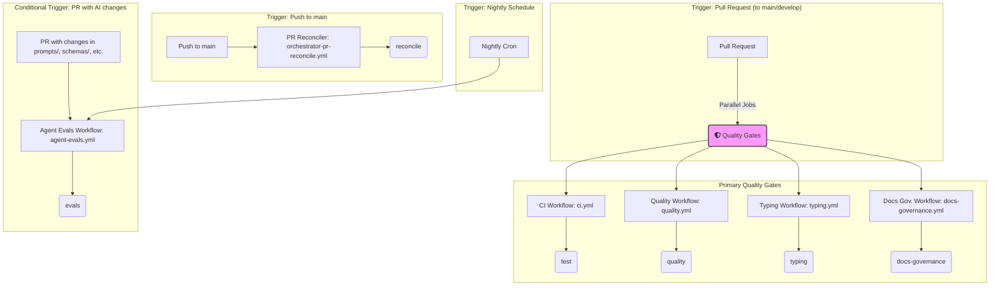

# CI/CD Workflow Visualization

This document provides a high-level visualization of the CI/CD pipelines implemented using GitHub Actions. The diagram illustrates the triggers, jobs, and dependencies that form our quality gates and automation processes.

## CI/CD Flow Diagram

The following diagram illustrates the different workflows that are triggered on pull requests and pushes to the `main` and `develop` branches.

