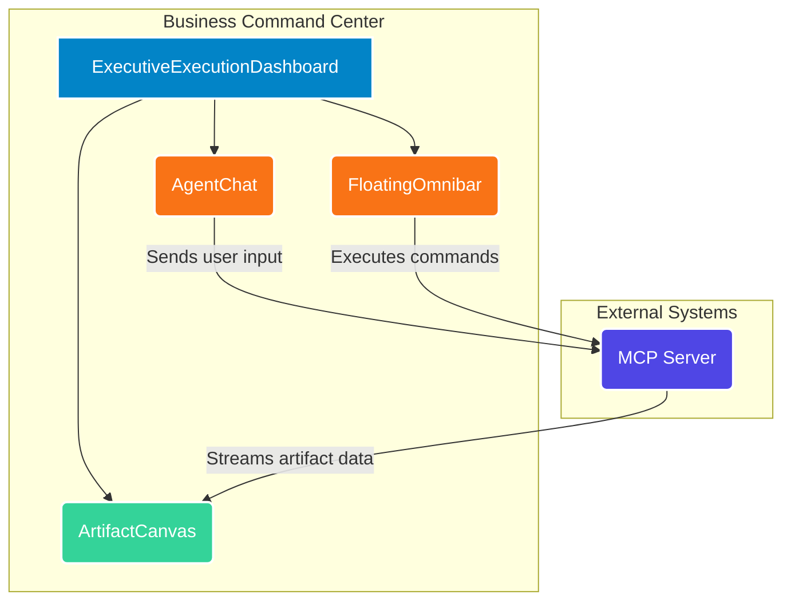

# Business Command Center

Esta es la interfaz gráfica de usuario (GUI) para el Assessment Engine, construida como parte de la Fase 4 de la arquitectura (El *Business Command Center*).

Esta plataforma web está diseñada para ser utilizada por Consultores y Negocio, consumiendo datos en tiempo real del backend de Python a través del Model Context Protocol (MCP).

## Tecnologías

- Next.js (App Router)
- React
- Tailwind CSS
- shadcn/ui

## Arquitectura de Componentes

El siguiente diagrama ilustra la relación de alto nivel entre los componentes clave de la interfaz y su interacción con el backend.



- **ExecutiveExecutionDashboard:** El componente principal que orquesta la visualización de los demás elementos.
- **ArtifactCanvas:** El área principal donde se renderizan y se interactúa con los artefactos generados por el motor de evaluación.
- **AgentChat:** La interfaz de chat para interactuar con los agentes de IA.
- **FloatingOmnibar:** Una barra de comandos para acceso rápido a acciones y herramientas.
- **MCP Server:** El backend de Python que proporciona los datos y la lógica de negocio.

## Desarrollo

Para arrancar el servidor de desarrollo local:

1.  **Navega al directorio:**
    ```bash
    cd src/business_command_center
    ```

2.  **Instala las dependencias:**
    ```bash
    npm install
    ```

3.  **Inicia el servidor de desarrollo:**
    ```bash
    npm run dev
    ```

Abre [http://localhost:3000](http://localhost:3000) en tu navegador para ver la interfaz.
